# Mesos, Spark, Kafka, InfluxDB and Grafana on a Raspberry Pi Cluster - Visualising IOT Sensor Data

This repo holds various ramblings, scripts and code put together for and experiment to visualise realtime sensor data processed on a cluster of Raspberry Pis. Not disimilar to https://www.circuits.dk/datalogger-example-using-sense-hat-influxdb-grafana/ but using the features of the cluster for near realtime processing.

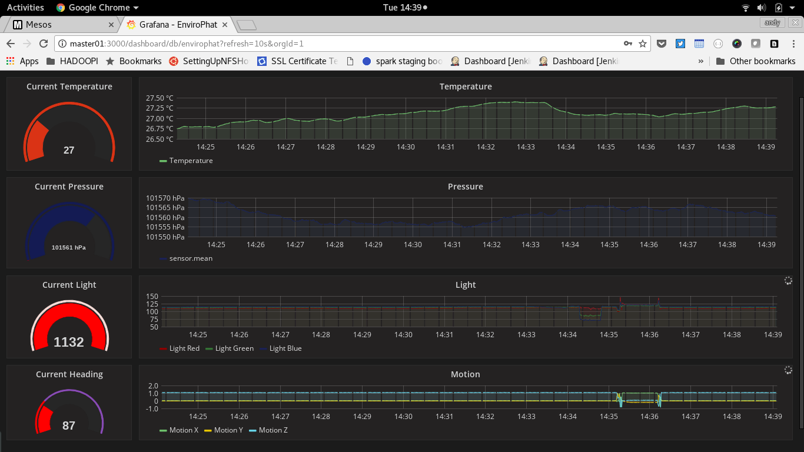

Unlike my [Hadoopi project](http://data.andyburgin.co.uk/post/157450047463/running-hue-on-a-raspberry-pi-hadoop-cluster), there isn't chef code to setup and configure a cluster of Raspberry Pis. The reason not to do this was although the resulting system runs, it's really using some of the components "becasue they are there" rather than it's the right technology choice. Originally this project was intended to implement a [SMACK (Spark, Mesos, Akka, Cassandra and Kafka) stack]( https://www.oreilly.com/ideas/the-smack-stack). But due to some of the technical constraints of the Pi it means the implementable components on a raspberry pi are somewhat outdated.

However, if you do look at the example files you'll see more of a SMKS stack (Spark, Mesos, Kafka and Scala) acting as a transfer mechanism between two additional Pis for capturing sensor mnetrics and visualsation the collected data. On the sensor side a Pi zero is using a [EnviroPhat](http://blog.pimoroni.com/enviro-phat/) pushing data to Kafak via Python. On the visualisation side there is an influxdb instance and grafana server to store and serve a realtime dashboard of the data.

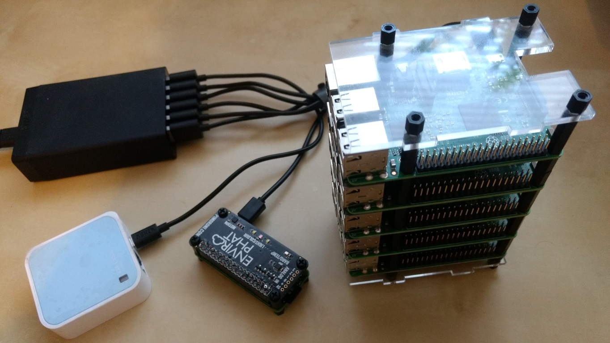

So if you want to play along it's a case of manual setup, please make sure your command line Fu is cranked up to 11!

## What You Will Need

The project uses a cluster of 5 Raspberry Pis, a wireless hub and 60W usb power adapter, full details of the cluster hardware can be found on the [Hadoopi project](http://data.andyburgin.co.uk/post/157450047463/running-hue-on-a-raspberry-pi-hadoop-cluster). You'll also need a development PC, I'm running Debian linux as it supports all the technologies and tools to build and deploy. Finally for the sensor I'm using an EnviroPhat from [PiMoroni](https://shop.pimoroni.com/products/enviro-phat) on a Raspberry Pi Zero W.

These instructions below will help you set up the cluster, this is how we are going to spread the workload across it:

* Raspberry Pi Zero W and EnviroPhat - Python application posting sensor data to a Kafka Topic
* Master01 - Running influxDB and Grafana
* Master02 - Mesos Master, Launch Scripts and NFS share for spark app checkpointing
* Worker01/02/03 - mesos slaves for running tasks from mesos

Each of the workers will run the spark application and kafka brokers as part of the mesos cluster.

You'll be using the development PC for building the scala application and submitting it to Spark, if you have Kafka intalled you can also use that to view the messages on the Kafka topic to help with troubleshooting.

As stated above this project really is an experiment because you could post metrics from the sensor Pi directly to influxdb - therefore the mesos, spark, scala and kafka components really are their just to learn.

## Compilation and Packaging

Becasue the Raspberry Pi uses an arm architecture we are going to have to compile Mesos and Kafka, you'll also find minimal documentation on achieving this, I'm using instructions that Netflix posted after one of their [hackdays](http://ispyker.blogspot.co.uk/2016/05/services-with-netflix-titus-and.html) and [blog post](http://blog.haosdent.me/2016/04/24/mesos-on-arm/). I'll be using the tried and trusted jessie lite 23-09-16 distribution of raspbian as I'd proven out some of the technology on the Hadoopi project.

So boot one of you Pis from a fresh install and run the following to prepare the environment for compiling:
```
sudo -i
apt-get update
apt-get -y install oracle-java8-jdk tar wget git autoconf libtool build-essential python-dev python-boto libcurl4-nss-dev libsasl2-dev libsasl2-modules maven libapr1-dev libsvn-dev
update-alternatives --config java
  select /usr/lib/jvm/jdk-8-oracle-arm32-vfp-hflt/jre/bin/java 
java -version  <--- check it's the 1.8 SDK
vi /etc/dphys-swapfile
  set CONF_SWAPSIZE to 1024
/etc/init.d/dphys-swapfile restart
free -h   <--- check you have 1GB of swap
```
Next clone and patch Mesos:
```
git clone https://github.com/apache/mesos.git
cd mesos/
git checkout tags/0.28.3
wget https://raw.githubusercontent.com/Netflix-Skunkworks/mesos-on-pi/master/mesos-docker/mesos.patch
wget https://raw.githubusercontent.com/Netflix-Skunkworks/mesos-on-pi/master/mesos-docker/add-to-patch.zookeeper
git apply < mesos.patch
cat add-to-patch.zookeeper > 3rdparty/zookeeper-3.4.5.patch
```
And now build the binary (warning this may take 3-4 hours):
```
./bootstrap
mkdir build
cd build
../configure --disable-python
make
mkdir /opt/mesos
make DESTDIR=/opt/mesos/ install 
tar -C /opt/mesos/ -zcvf /home/pi/mesos-install.tar.gz .
```
Now transfer the binary ```mesos-install.tar.gz``` down to the dev pc

Next we need to make the kafka binary for mesos, following from the above build on the Pi:
```
cd
apt-get -y install oracle-java8-jdk git
java -version  <--- check it's the 1.8 SDK
git clone https://github.com/mesos/kafka
cd kafka
vi build.gradle
     version <--- change this to theabsolute path for Config.scala, so prepend /root/kafka/
./gradlew jar downloadKafka
cd /root
tar -C /root/kafka/ -zcvf /home/pi/kafka-install.tgz .
```
Now transfer the binary ```kafka-install.tgz``` down to the dev pc

You can now power off the Pi and wipe the sdcard for reuse.

# Setup OS and Networking
On each of the 5 nodes in the cluster - master01/02/worker01/02/03 (so excluding the sensor Pi). The Network is is setup to use the 10.0.0.255 subnet with master01/02 at 10.0.0.11 and 12, the workers being 21, 22, 23. 
```
sudo -i
apt-get update
vi /etc/wpa_supplicant/wpa_supplicant.conf
	country=GB
	ctrl_interface=DIR=/var/run/wpa_supplicant GROUP=netdev
	update_config=1

	network={
			ssid="XXXXXXXX"    <---- replace twith the SSID and KEY for the wireless network
			psk="YYYYYYYY"
	}

vi /etc/dhcpcd.conf
	...add to bottom...
	interface wlan0
	static ip_address=10.0.0.XX/24  <-- 10.0.0.11,12,21,22,23 as appropriate
	static routers=10.0.0.1
	static domain_name_servers=10.0.0.1

hostnamectl set-hostname ZZZZZZ <- change to master01/02/worker01/02/03 as appropriate

vi /etc/hosts
	...add to bottom...
	10.0.0.11       master01
	10.0.0.12       master02
	10.0.0.21       worker01
	10.0.0.22       worker02
	10.0.0.23       worker03

vi /etc/ssh/ssh_config
	...add to bottom...
	StrictHostKeyChecking no    <--- this will break sshd on a stretch based distro of raspbian, it's ok on jessie

service networking restart
ifup wlan0
ifconfig <---- check got correct ip
apt-get install nscd
```
You may for convenience wish to setup passwordless login from your dev pc
```
ssh-copy-id -i ~/.ssh/id_rsa.pub pi@ZZZZZZZZ <- master01/02/worker01/02/03
```
At this point you should have all 5 cluster nodes setup with network connectivity, the correct hostnames and access to the other nodes in the cluster.


## Setting up the Worker Nodes

Now we are going to setup each of the worker nodes installing mesos, zookeeper, spark and startup script.

Firstly copy the mesos binary from you dev pc to each pi
```
scp mesos-install.tar.gz pi@workerXX:~
```
Then on each worker pi:
```
sudo -i
cd /
tar -zxvf /home/pi/mesos-install.tar.gz
apt-get install libcurl4-nss-dev libsvn-dev 
mkdir /opt/mesos-slave-work_dir

sudo -i
apt-get install oracle-java8-jdk
apt-get install zookeeperd
vi /etc/zookeeper/conf/zoo.cfg
	...add server list...
	server.1=worker01:2888:3888
	server.2=worker02:2888:3888
	server.3=worker03:2888:3888

echo "X" > /etc/zookeeper/conf/myid   <---- X is 1, 2 or 3 correcponding to worker01/02/03
service zookeeper start
```
Next Create the startup script in /root, change the "ip" and "hostname" as applicable for the node 
```
cd
vi startup.sh
	#!/bin/bash
	mount -t nfs4 10.0.0.12:/ /mnt
	mesos-slave --log_dir=/var/log/mesos/ --work_dir=/opt/mesos-slave-work_dir  --ip=10.0.0.XX --hostname=workerXX --master=zk://worker01:2181,worker02:2181,worker03:2181/mesos --launcher=posix --resources="cpus(*):2; mem(*):768;disk(*):40000;ports:[31000-32000,7000-7001,7199-7199,9042-9042,9160-9160]"   <---- replace XX with ip address and hostname

chmod a+x startup.sh
```
Now setup spark
```
cd /opt/
wget https://archive.apache.org/dist/spark/spark-1.6.2/spark-1.6.2-bin-hadoop2.6.tgz
tar -zxvf spark-1.6.2-bin-hadoop2.6.tgz
ln -s /opt/spark-1.6.2-bin-hadoop2.6 /opt/spark

cp spark-1.6.2-bin-hadoop2.6/conf/spark-defaults.conf.template spark-1.6.2-bin-hadoop2.6/conf/spark-defaults.conf
vi spark-1.6.2-bin-hadoop2.6/conf/spark-defaults.conf
	spark.network.timeout              500s
	spark.testing.reservedMemory       64000000
	spark.testing.memory               128000000

cp spark-1.6.2-bin-hadoop2.6/conf/spark-env.sh.template spark-1.6.2-bin-hadoop2.6/conf/spark-env.sh
vi spark-1.6.2-bin-hadoop2.6/conf/spark-env.sh
	...add to bottom...
	SPARK_MASTER_IP=10.0.0.12
```
That's the worker nodes ready to go.


## Setting up master02

The master02 node is the most fidly to setup, it runs the majority of services, so there are a few steps to install, mesos, spark, nfs share and kafka.

Copy the required files to the Pi - that's startup scripts, the mesos and kafka bianaries onto the node:
```
scp scripts/*.sh pi@master02:~
scp mesos-install.tar.gz pi@master02:~
scp kafka-install.tgz pi@master02:~
```
Then install mesos:
```
sudo -i
cd /
tar -zxvf /home/pi/mesos-install.tar.gz
apt-get install libcurl4-nss-dev libsvn-dev 
```
Next we need to setup an nfs share for the spark applicataions to use for checkpointing, details taken from http://www.instructables.com/id/Turn-Raspberry-Pi-into-a-Network-File-System-versi/
```
apt-get install nfs-common nfs-kernel-server
mkdir -p /srv/nfs4/share
chmod a+w /srv/nfs4/share/
vi /etc/exports
    /srv/nfs4/share 10.0.0.21(rw,sync,no_subtree_check)
    /srv/nfs4/share 10.0.0.22(rw,sync,no_subtree_check)
    /srv/nfs4/share 10.0.0.23(rw,sync,no_subtree_check)

wget https://cdn.instructables.com/ORIG/F10/L3AF/I6HSMRV1/F10L3AFI6HSMRV1.script
mv F10L3AFI6HSMRV1.script /etc/init.d/nfs-kernel-server
wget https://cdn.instructables.com/ORIG/FS8/4950/I6HSMRZH/FS84950I6HSMRZH.cfg
mv FS84950I6HSMRZH.cfg /etc/default/nfs-kernel-server
vi /etc/default/nfs-common
    NEED_STATD="no"
    NEED_IDMAPD="yes"
chmod a+x /etc/init.d/nfs-kernel-server
update-rc.d rpcbind enable
update-rc.d nfs-kernel-server enable
service rpcbind start
service nfs-kernel-server start
```
Next **repeat the install of spark** on master02 as was done on the worker nodes.

Now install kafka:
```
cd /opt
mkdir kafka
cd kafka
tar -zxvf /home/pi/kafka-install.tgz
vi /opt/kafka/kafka-mesos.properties
    ...remove all lines and add...
    storage=zk:/kafka-mesos
    master=zk://worker01:2181,worker02:2181,worker03:2181/mesos
    zk=worker01:2181,worker02:2181,worker03:2181/KafkaCluster
    api=http://master02:7000
```
Finally move that startup scripts to /root
```
mv /home/pi/*.sh /root
chmod a+x /root/*.sh
```
That's master02 ready to go.


## Setting up master01

We'll install [2 TICK stack components](https://www.influxdata.com/time-series-platform/) - [influxdb](https://www.influxdata.com/time-series-platform/influxdb/) 1.4 (which unfortunately doesn't have the free clustering option) and the [Chronograf](https://www.influxdata.com/time-series-platform/chronograf/). For dashboards we'll also install [Grafana](https://grafana.com/).

Let's install influxdb and create an empty database for our data:
```
sudo -i
apt-get install apt-transport-https
curl -sL https://repos.influxdata.com/influxdb.key | sudo apt-key add - source /etc/os-release
echo "deb https://repos.influxdata.com/debian jessie stable" | sudo tee /etc/apt/sources.list.d/influxdb.list 
apt-get update
apt-get install influxdb

vi /etc/influxdb/influxdb.conf
    [http]
    # Determines whether HTTP endpoint is enabled.
    enabled = true

    # The bind address used by the HTTP service.
    bind-address = ":8086"

    # Determines whether user authentication is enabled over HTTP/HTTPS.
    auth-enabled = false

service influxd restart
influx  -precision rfc3339
    ---issue db creation command ---
    create database sensordata
    exit
```
Next install Chronograf:
```
apt-get install chronograf
systemctl start chronograf
http://master01:8888
```
Next lets install Grafana:
```
apt-get install apt-transport-https curl
curl https://bintray.com/user/downloadSubjectPublicKey?username=bintray | sudo apt-key add -
echo "deb https://dl.bintray.com/fg2it/deb jessie main" | sudo tee -a /etc/apt/sources.list.d/grafana.list
apt-get update
apt-get install grafana

vi /etc/grafana/grafana.ini
    [server]
    # Protocol (http, https, socket)
    protocol = http

    # The ip address to bind to, empty will bind to all interfaces
    ;http_addr =

    # The http port  to use
    http_port = 3000
service grafana-server restart
```
Check http://master01:3000 to check grafana is working

## Setting up the Sensor

Connect up the EnviroPhat and boot, next configure the networking as for the main cluster, I chose 10.0.0.99 as the ip.

Upload the sensor.py code
```
scp sensor/sensor.py pi@XXXXX:~    <--- replace XXX with the ip of your sensor pi
```
Install the supporting libraries and configure:
```
sudo -i
apt-get install pip python-envirophat
pip2 install envirophat
sudo raspi-config <------ enable i2c bus from the interfaces option
pip2 install kafka-python
```
Everything is ready to go

## Starting up the Cluster

This is where the fun starts, Make sure all the Pis are up and running and we can start playing.

Open 3 terminal windows to worker01/02/03
```
sudo -i
./startup.sh
```
The workers should have mounted the nfs share from master02 and kick off the mesos slave deamons.

Next open 3 terminal windows to master02
```
sudo -i
./start-mesos-master.sh
```
Open http://master02:5050/#/slaves check mesos is running

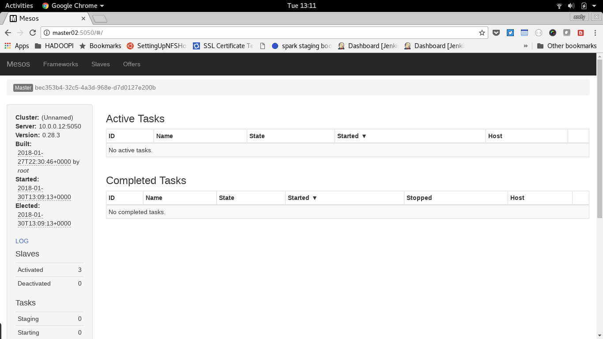

Take a look at the slaves and check our worker nodes are present and correct.

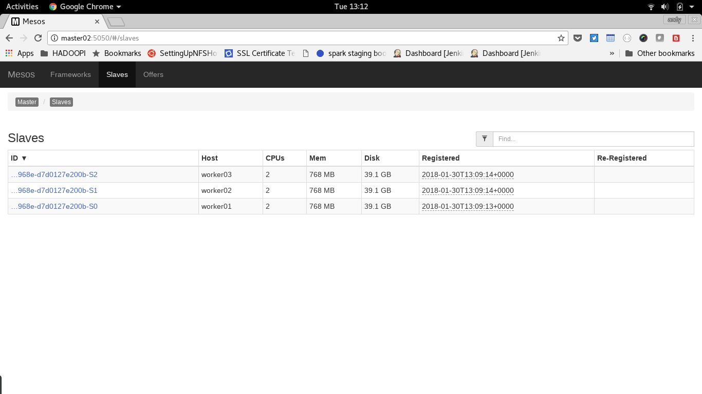

Now start the spark and kafka frameworks
```
sudo -i
./start-spark-framework.sh
./start-kafka-framework.sh
```
Open http://master02:5050/#/frameworks  check both frameworks are running:

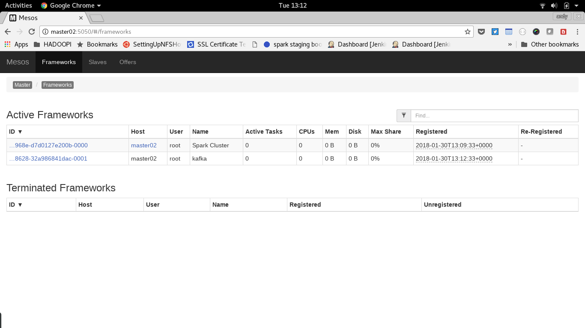

For first run only you'll need to create the Kafka brokers, note we are pinning each broker to a specific worker via the constraints option:
```
sudo -i
cd /opt/kafka
./kafka-mesos.sh broker add 0 --constraints hostname=like:worker01 --heap 64 --mem 128 --options log.cleaner.dedupe.buffer.size=67108864 --jvm-options "-Xmx128M -Xms64M"
./kafka-mesos.sh broker add 1 --constraints hostname=like:worker02 --heap 64 --mem 128 --options log.cleaner.dedupe.buffer.size=67108864 --jvm-options "-Xmx128M -Xms64M"
./kafka-mesos.sh broker add 2 --constraints hostname=like:worker03 --heap 64 --mem 128 --options log.cleaner.dedupe.buffer.size=67108864 --jvm-options "-Xmx128M -Xms64M"
```
Then for this and subsquent runs start the brokers with:
```
sudo -i
./start-kafka-brokers.sh
./list-kafka-brokers.sh
```
Open http://master02:5050/#/ check the 3 tasks are running for the Kafka brokers

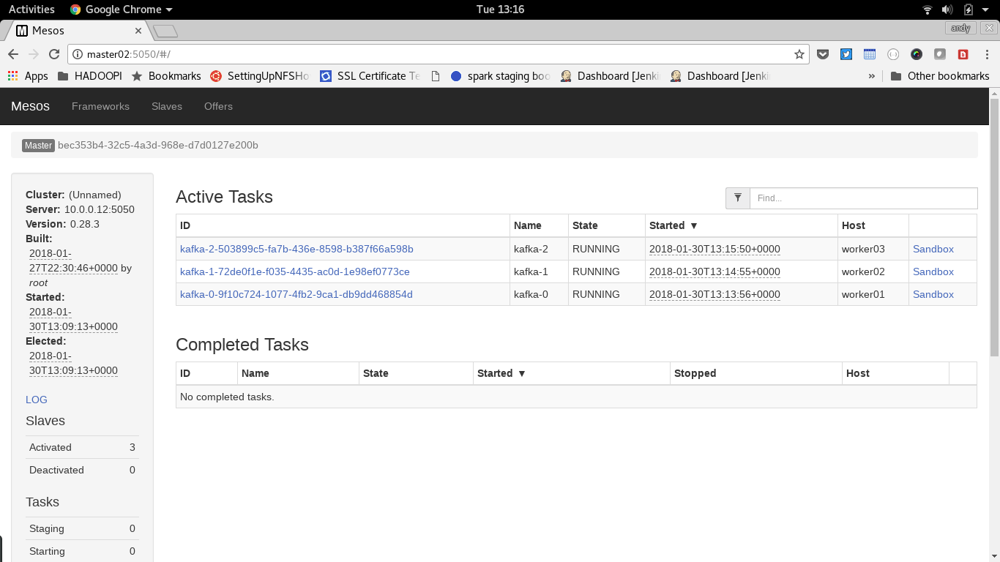

## Get the Sensor Sending Metrics to Kafka

Next ssh to the sensor pi and run:
```
python sensor.py
```
On the dev pc, locate your local kafka install and read from the kafka topic with the console consumer to check messages are making it to kafka
```
./bin/kafka-console-consumer.sh --bootstrap-server 10.0.0.21:7000,10.0.0.22:7000,10.0.0.23:7000 --topic test --from-beginning
```
You'll see the sensor data from kafka being displayed on the consumer console.

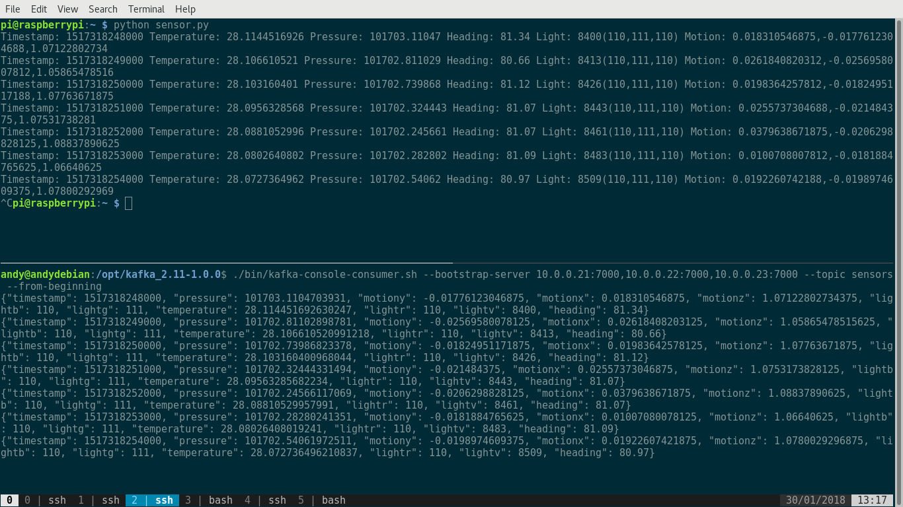

## Building the scala application and getting ready to deploy

One of the challenges I set myself with this project was to write code in a new language, I chose to use Scala and Spark streaming (an ideal fit for mesos), much of the work is based around the learnings from a couple of books and the excellent [Taming Big Data with Spark Streaming and Scala - Hands On!](https://www.packtpub.com/big-data-and-business-intelligence/taming-big-data-spark-streaming-and-scala-%E2%80%93-hands-video) by Frank Kane.

I've put together a small spark streaming app that loads small batches of data from kafka and pushes them to influxdb. One of the main frustrations during development was library dependency issues, I worked originally in ScalaIDE http://scala-ide.org/ submitting the app to my local spark instance using the data source on the Pi Cluster. This was somewhat "clunky" but worked, packaging up the application to deploy to the cluster using the [Scala Build Tool](https://www.scala-sbt.org/) was also problematic, but after much wrangling I got it working. Here's the files included for the KafkaSensor app:
```
.
├── build.sbt
├── project
│   └── assembly.sbt
└── src
    └── main
    ├── resources
    │   └── application.conf
    └── scala
        ├── KafkaSensor.scala
        ├── Settings.scala
        └── Utility.scala
```
To build the fat/uber jar (app, config and dependencies), install sbt from https://www.scala-sbt.org/ Set the version in ```project/assembly.sbt``` as directed in https://github.com/sbt/sbt-assembly. The dependencies are defined in the ```build.sbt```:
```
libraryDependencies ++= Seq(
"org.apache.spark" %% "spark-core" % "1.6.2" % "provided",
"org.apache.spark" %% "spark-streaming" % "1.6.2" % "provided"
)

libraryDependencies += "org.apache.spark" %% "spark-streaming-kafka" % "1.6.2"
libraryDependencies += "org.apache.kafka" %% "kafka" % "0.8.2.1"
libraryDependencies += "org.apache.spark" %% "spark-sql" % "1.6.2"
libraryDependencies += "com.typesafe.play" %% "play-json" % "2.6.8"
libraryDependencies += "com.pygmalios" %% "reactiveinflux" % "0.10.0.5"
libraryDependencies += "com.typesafe" % "config" % "1.2.1"
```
There include libraries for kafka, json parsing, config managment an influxdb. The job of sbt is to go and grab the nested dependencies of jars needed to build the jar and package it up for runtime.

You may want to review the run time settings included in the project in ```src/main/resources/application.conf```.

To build the jar run:
```
sbt assembly
```
If all goes welll you'll have a jar file ```target/scala-2.10/KafkaSensor-assembly-1.0.jar```

## Running the Scala Application on the Cluster

Now we have compiled our application, we need to use the spark libraries on the development pc to submit the application to the cluster.

Open 2 terminal windows on your dev pc. In one window run a web server to allow the cluster to load your jar:
```
cd target/scala-2.10
python -m SimpleHTTPServer 8000
```

In the second, submit the spark applicaton (you'll need the spark binaries installed), replace the 10.0.0.9 with you dev pc ip
```
/opt/spark/bin/spark-submit --class com.andyburgin.sparkstreaming.KafkaSensor  --master mesos://master02:7077 --deploy-mode cluster --conf spark.testing.reservedMemory="64000000" --conf spark.testing.memory="128000000" --executor-memory 256m --driver-memory 256m --num-executors 1 http://10.0.0.9:8000/KafkaSensor-assembly-1.0.jar
```
You'll note the teeny memory settings needed to get the app to run on the cluster  (see the [hadoopi project](http://data.andyburgin.co.uk/post/157450047463/running-hue-on-a-raspberry-pi-hadoop-cluster) for more details on cluster memory allocation). Check the application is running on the cluster http://master02:5050/#/ watch the driver and then worker tasks be created

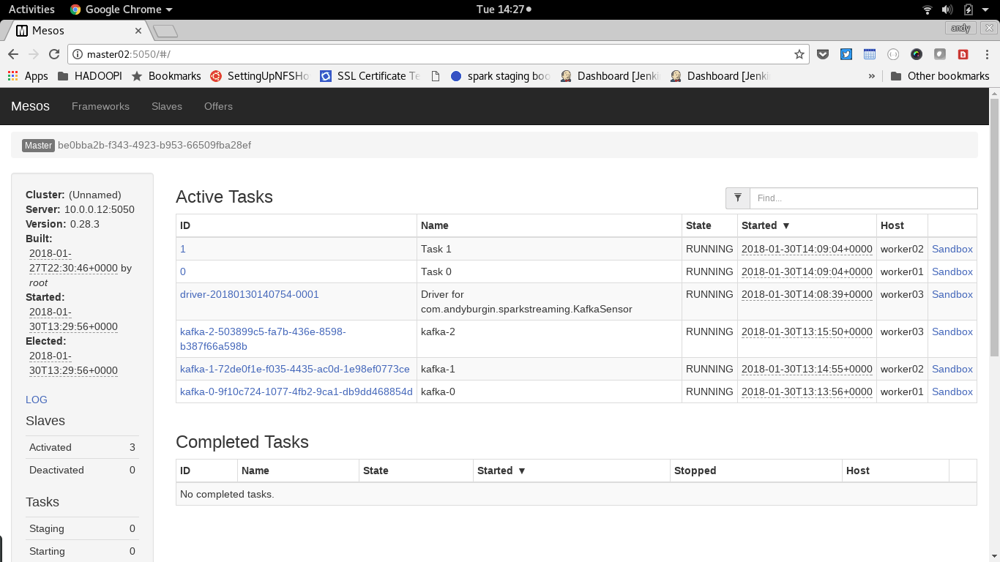

Select one of the tasks and look at the "stdout" output, you should see the heartbeat message

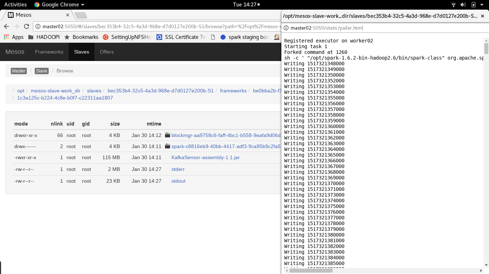

## View Metrics in Chronograf + Grafana

Now the application is running, lets look at the data being collected in Chronograf, point the browser at http://master01:8888/

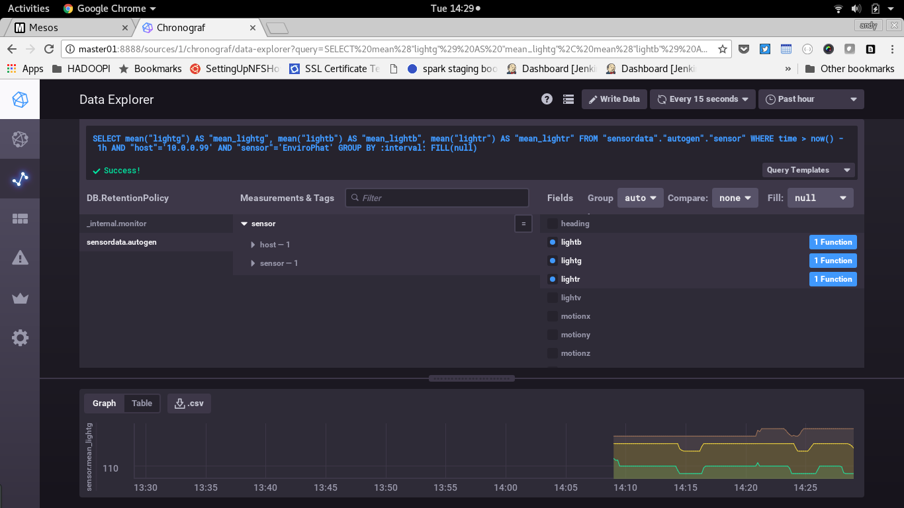

Use the data explorer to quickly find the metrics and knock up a quick graph.

Next we need to set up Grafana, make sure the server is running on master01 and restart it if not
```
sudo -i
service grafana-server restart
```
Log into Grafana by hitting http://master01:3000/, login as user "admin" password "admin" (change these at your leisure)
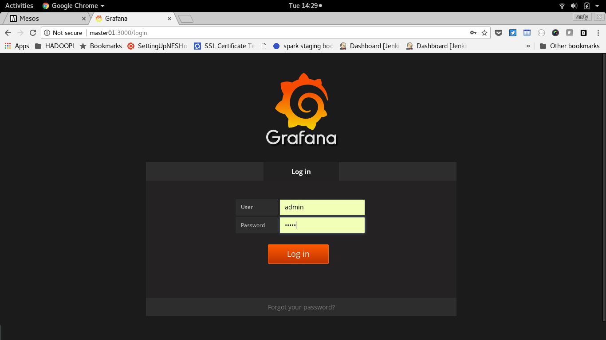

Next set up the influxdb data source to http://master01:8086

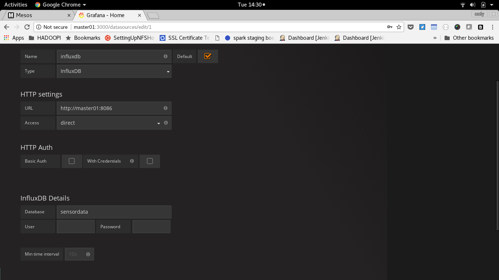

Then import the "grafana/EnviroPhat.json" dashboard.

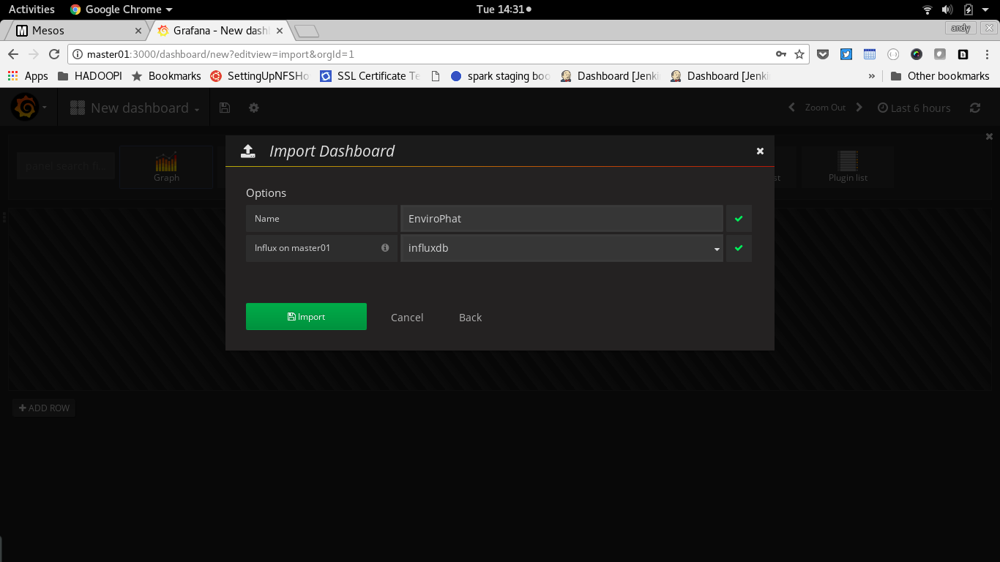

And at long last view the dashboard and metrics


## Stopping the App and Cluster

To kill the spark app, much like how it was launched run:
```
/opt/spark/bin/spark-submit --master mesos://master02:7077 --kill driver-XXXXXXXXXXXXXXXXXXXX
```
Replace the driver id as applicable, check the tasks in mesos have ended http://master02:5050/#/

To shut the whole cluster down, first cleanly stop the Kafka brokers and Spark framework on master02
```
sudo -i
./stop-kafka-brokers.sh
./stop-spark-framework.sh
```
Then terminate the running processes for the kafka framework and mesos master by hitting ^C on each terminal window on master02, also do this on the mesos slave processes on each worker.

## Summary
As you'll have seen this is very much an experiment, the original plan to build a SMACK stack haven't come to fruition. The cluster is really a massive overkill to simply recreate https://www.circuits.dk/datalogger-example-using-sense-hat-influxdb-grafana/

But in doing this I've learned a whole heap about Mesos, Spark and Scala and that was always the intention (and it turns out my soldering skills aren't too bad either).


